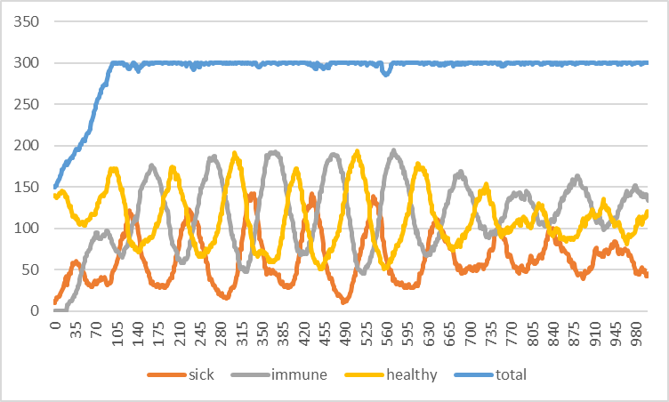
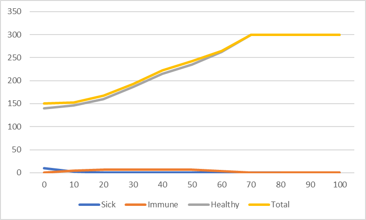
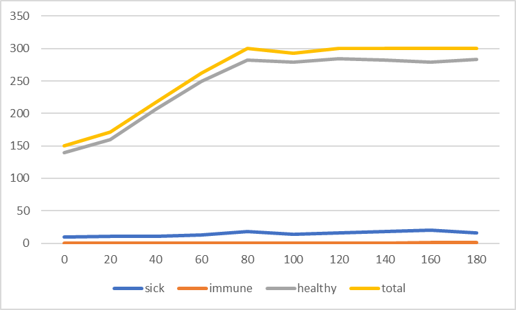

## Комп'ютерні системи імітаційного моделювання

## СПм-23-3, **Долгополов Олексій Максимовч**

### Лабораторна робота №**1**. Опис імітаційних моделей та проведення обчислювальних експериментів

 

### Варіант 3, модель у середовищі NetLogo:

[Virus](https://www.netlogoweb.org/launch#https://www.netlogoweb.org/assets/modelslib/Sample%20Models/Biology/Virus.nlogo)

 

### Вербальний опис моделі:

Модель поширення захворювання у людській популяції, де кожна людина представлена агентом (черепашкою). Кожен агент може бути в одному з трьох станів: здоровий, інфікований або імунний (після одужання). Інфіковані агенти можуть передавати захворювання іншим здоровим агентам, якщо ті знаходяться поруч. Через певний час хворі агенти можуть або одужати й отримати тимчасовий імунітет, або померти. Модель також враховує старіння та можливість народження нового потомства (агентів), що створює додаткову динаміку популяції.

### Керуючі параметри:

- **number-people** визначає кількість черепашок (агентів) у популяції..
- **infectiousness** визначає ймовірність зараження здорового агента під час контакту з інфікованим.
- **duration** визначає, як довго агент залишається інфікованим перед можливим одужанням або смертю.
- **chance-recover** визначає ймовірність того, що інфікований агент одужає після тривалого захворювання.
- **carrying-capacity** визначає максимальну кількість агентів у середовищі.
- **lifespan** визначає максимальну тривалість життя агента.
- **immunity-duration** визначає, скільки часу після одужання агент залишається імунним.

### Внутрішні параметри:

- **sick**. Стан агента: чи є він інфікованим.
- **remaining-immunity**. Кількість часу (в тижнях), протягом якого агент залишається імунним після одужання.
- **sick-time**. Час (в тижнях), який агент провів у стані інфекції.
- **age**. Вік агента (в тижнях).

### Показники роботи системи:

- відсоток інфікованих агентів на поточний момент часу.
- відсоток імунних агентів.
- кількість агентів, що одужали або померли.
- кількість нових заражень за кожен такт симуляції.

### Примітки:

Ця модель дає змогу вивчати динаміку поширення захворювань і взаємодію між хворобою, імунітетом і демографічними змінами в популяції. Враховуючи випадкове пересування агентів та випадковість заражень, можна отримати різні сценарії розвитку епідемії залежно від початкових параметрів.

### Недоліки моделі:

Модель не враховує фактори, такі як індивідуальні відмінності в сприйнятливості до захворювання або можливість мутацій вірусу. Також відсутня можливість повторного зараження одразу після втрати імунітету.

 

## Обчислювальні експерименти

### 1. Вплив передачі та увічнення вірусу в людській популяції.

Досліджується залежність чисельності здорових людей до хворих та імунних протягом певної кількості тактів 1000.
Експерименти проводяться при різних початкових співвідношеннях.
Інші керуючі параметри мають значення за замовчуванням:

- **number-people**: 150
- **infectiousness**: 65%
- **chance-recover**: 75%
- **duration**: 20 (weeks)

<table>
<thead>
<tr><th>Weeks</th><th>Healthy people</th><th>Sick people</th><th>Immune people</th></tr>
</thead>
<tbody>
<tr><td>100</td><td>172</td><td>49</td><td>79</td></tr>
<tr><td>200</td><td>173</td><td>47</td><td>80</td></tr>
<tr><td>300</td><td>180</td><td>28</td><td>92</td></tr>
<tr><td>400</td><td>155</td><td>32</td><td>113</td></tr>
<tr><td>500</td><td>177</td><td>24</td><td>99</td></tr>
<tr><td>600</td><td>132</td><td>28</td><td>140</td></tr>
<tr><td>700</td><td>101</td><td>52</td><td>147</td></tr>
<tr><td>800</td><td>102</td><td>57</td><td>141</td></tr>
<tr><td>900</td><td>112</td><td>48</td><td>139</td></tr>
<tr><td>1000</td><td>120</td><td>46</td><td>134</td></tr>
</tbody>
</table>

На графіку можна побачити невелике коливання у співвідношенні здорових людей до імунних чи хворих. В цілому їх значення знаходяться в одному діапазоні з невеликою похибкою.

### 2. Вплив заразності вірусу та короткого терміну життя при невеликому шансі на одужання на кількість хворих людей.

Запропонований автором эксперемент де відомий вірус Ебола в Центральній Африці має дуже коротку тривалість життя, дуже високу інфекційність і надзвичайно низький рівень одужання.

- **number-people**: 150
- **infectiousness**: 90%
- **chance-recover**: 25%
- **duration**: 4 (weeks)

<table>
<thead>
<tr><th>Weeks</th><th>Sick people</th><th>Immune people</th><th>Healthy people</th><th>Total</th></tr>
</thead>
<tbody>
<tr><td>0</td><td>10</td><td>0</td><td>140</td><td>150</td></tr>
<tr><td>10</td><td>2</td><td>5</td><td>146</td><td>153</td></tr>
<tr><td>20</td><td>0</td><td>7</td><td>160</td><td>167</td></tr>
<tr><td>30</td><td>0</td><td>7</td><td>186</td><td>193</td></tr>
<tr><td>40</td><td>0</td><td>7</td><td>215</td><td>222</td></tr>
<tr><td>50</td><td>0</td><td>7</td><td>235</td><td>242</td></tr>
<tr><td>60</td><td>0</td><td>3</td><td>262</td><td>265</td></tr>
<tr><td>70</td><td>0</td><td>0</td><td>300</td><td>300</td></tr>
<tr><td>80</td><td>0</td><td>0</td><td>300</td><td>300</td></tr>
<tr><td>90</td><td>0</td><td>0</td><td>300</td><td>300</td></tr>
<tr><td>100</td><td>0</td><td>0</td><td>300</td><td>300</td></tr>
</tbody>
</table>

На графіку можна побачити, що вірус не є досить ефективним порівнянно з минулим варіантом.

### 3. Підбір значень параметрів deceleration та acceleration для уникнення пробок на трасі

Досліджується эксперемент вірус ВІЛ, має надзвичайно довгу тривалість життя, надзвичайно низький рівень одужання, але надзвичайно низьке значення інфекційності.

- **number-people**: 150
- **infectiousness**: 5%
- **chance-recover**: 1%
- **duration**: 99 (weeks)

<table>
    <thead>
        <tr>
            <th>Weeks</th>
            <th>Sick people</th>
            <th>Immune people</th>
            <th>Healthy people</th>
            <th>Total</th>
        </tr>
    </thead>
    <tbody>
        <tr>
            <td>0</td>
            <td>10</td>
            <td>0</td>
            <td>140</td>
            <td>150</td>
        </tr>
        <tr>
            <td>20</td>
            <td>11</td>
            <td>0</td>
            <td>160</td>
            <td>171</td>
        </tr>
        <tr>
            <td>40</td>
            <td>11</td>
            <td>0</td>
            <td>206</td>
            <td>217</td>
        </tr>
        <tr>
            <td>60</td>
            <td>13</td>
            <td>0</td>
            <td>249</td>
            <td>262</td>
        </tr>
        <tr>
            <td>80</td>
            <td>18</td>
            <td>0</td>
            <td>282</td>
            <td>300</td>
        </tr>
        <tr>
            <td>100</td>
            <td>14</td>
            <td>0</td>
            <td>279</td>
            <td>293</td>
        </tr>
        <tr>
            <td>120</td>
            <td>16</td>
            <td>0</td>
            <td>284</td>
            <td>300</td>
        </tr>
        <tr>
            <td>140</td>
            <td>18</td>
            <td>0</td>
            <td>282</td>
            <td>300</td>
        </tr>
        <tr>
            <td>160</td>
            <td>20</td>
            <td>1</td>
            <td>279</td>
            <td>300</td>
        </tr>
        <tr>
            <td>180</td>
            <td>16</td>
            <td>1</td>
            <td>283</td>
            <td>300</td>
        </tr>
    </tbody>
</table>

На графіку можна побачити, що вірус завжди має хворих людей на відміну від минулого експерименту, але не є дуже поширеним та ефективним.
