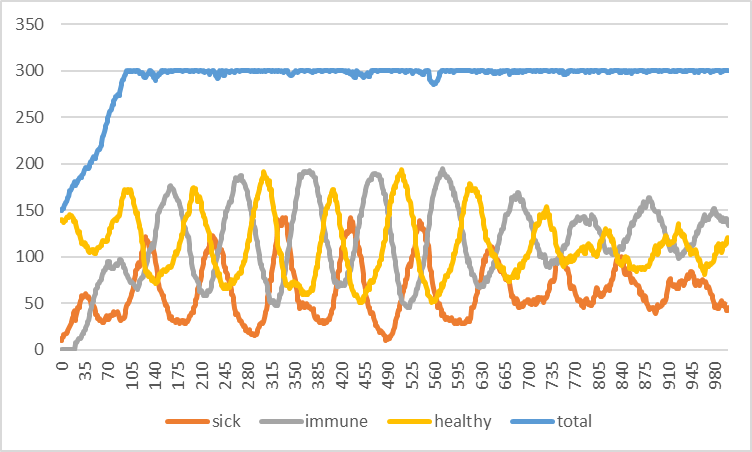
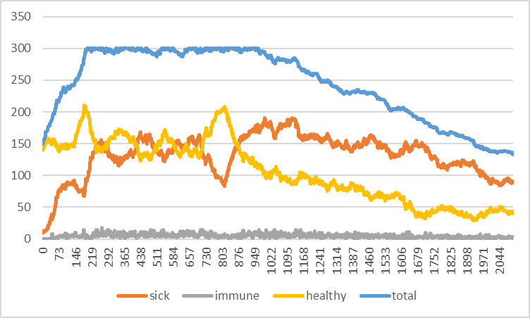

## Комп'ютерні системи імітаційного моделювання

## СПм-23-3, **Долгополов Олексій Максимовч**

### Лабораторна робота №**2**. Опис імітаційних моделей та проведення обчислювальних експериментів

 

### Варіант 3, модель у середовищі NetLogo:

[Virus](https://www.netlogoweb.org/launch#https://www.netlogoweb.org/assets/modelslib/Sample%20Models/Biology/Virus.nlogo)

 

### Вербальний опис моделі:

Модель поширення захворювання у людській популяції, де кожна людина представлена агентом (черепашкою). Кожен агент може бути в одному з трьох станів: здоровий, інфікований або імунний (після одужання). Інфіковані агенти можуть передавати захворювання іншим здоровим агентам, якщо ті знаходяться поруч. Через певний час хворі агенти можуть або одужати й отримати тимчасовий імунітет, або померти. Модель також враховує старіння та можливість народження нового потомства (агентів), що створює додаткову динаміку популяції.

### Варіант завдань

Додати вплив віку на інфікування та результат захворювання. Додати вплив ступеня поширення захворювання (поточного відсотка інфікованих) на вірогідність появи нових агентів. Додати можливість регулювання тривалості імунітету та вірогідності захворіти повторно.

#### Зміна на власний розсуд:

**Мутація захворювання** - Механізм мутації, коли через певний час інфекційність змінюється для всіх нових заражень.

### Керуючі параметри:

- **number-people** визначає кількість черепашок (агентів) у популяції..
- **infectiousness** визначає ймовірність зараження здорового агента під час контакту з інфікованим.
- **duration** визначає, як довго агент залишається інфікованим перед можливим одужанням або смертю.
- **chance-recover** визначає ймовірність того, що інфікований агент одужає після тривалого захворювання.
- **carrying-capacity** визначає максимальну кількість агентів у середовищі.
- **lifespan** визначає максимальну тривалість життя агента.
- **immunity-duration** визначає, скільки часу після одужання агент залишається імунним.
- **age-infection-factor** Вплив віку на інфекцію
- **adjusted-reproduction** Ймовірність розмноження залежно від % інфікованих
- **reinfection-risk** Керування імунітетом та ризиком повторного зараження

### Внутрішні параметри:

- **sick**. Стан агента: чи є він інфікованим.
- **remaining-immunity**. Кількість часу (в тижнях), протягом якого агент залишається імунним після одужання.
- **sick-time**. Час (в тижнях), який агент провів у стані інфекції.
- **age**. Вік агента (в тижнях).

### Показники роботи системи:

- відсоток інфікованих агентів на поточний момент часу.
- відсоток імунних агентів.
- кількість агентів, що одужали або померли.
- кількість нових заражень за кожен такт симуляції.
- визначає, скільки часу після одужання агент залишається імунним.
- керування імунітетом та ризиком повторного зараження

### Примітки:

Ця модель дає змогу вивчати динаміку поширення захворювань і взаємодію між хворобою, імунітетом і демографічними змінами в популяції. Враховуючи випадкове пересування агентів та випадковість заражень, можна отримати різні сценарії розвитку епідемії залежно від початкових параметрів.

 

## Обчислювальні експерименти

### 1. Вплив передачі та увічнення вірусу в людській популяції.

Досліджується залежність між першим експерементом та зміненую моделю для другої лаботаорної, де було додано:

- Мутація захворювання
- Вплив віку на ймовірність зараження та результат захворювання
- Вплив рівня поширення захворювання на вірогідність появи нових агентів
- Регулювання тривалості імунітету та ймовірності повторного зараження

### Основні данні залишилися такими самими, окрім нових

- **number-people**: 150
- **infectiousness**: 65%
- **chance-recover**: 75%
- **duration**: 40 (weeks) - 123 (weeks)
- **immunity-duration**: 4
- **reinfection-risk**: 100%

<table>
<thead>
<tr><th>Weeks</th><th>Healthy people</th><th>Sick people</th><th>Immune people</th></tr>
</thead>
<tbody>
<tr><td>100</td><td>172</td><td>49</td><td>79</td></tr>
<tr><td>200</td><td>173</td><td>47</td><td>80</td></tr>
<tr><td>300</td><td>180</td><td>28</td><td>92</td></tr>
<tr><td>400</td><td>155</td><td>32</td><td>113</td></tr>
<tr><td>500</td><td>177</td><td>24</td><td>99</td></tr>
<tr><td>600</td><td>132</td><td>28</td><td>140</td></tr>
<tr><td>700</td><td>101</td><td>52</td><td>147</td></tr>
<tr><td>800</td><td>102</td><td>57</td><td>141</td></tr>
<tr><td>900</td><td>112</td><td>48</td><td>139</td></tr>
<tr><td>1000</td><td>120</td><td>46</td><td>134</td></tr>
</tbody>
</table>

<table>
  <thead>
    <tr>
      <th>Weeks</th>
      <th>Healthy people</th>
      <th>Sick people</th>
      <th>Immune people</th>
    </tr>
  </thead>
  <tbody>
    <tr><td>100</td><td>144</td><td>80</td><td>7</td></tr>
    <tr><td>200</td><td>198</td><td>96</td><td>5</td></tr>
    <tr><td>300</td><td>159</td><td>130</td><td>8</td></tr>
    <tr><td>400</td><td>156</td><td>134</td><td>10</td></tr>
    <tr><td>500</td><td>139</td><td>144</td><td>9</td></tr>
    <tr><td>1000</td><td>95</td><td>182</td><td>12</td></tr>
    <tr><td>1250</td><td>87</td><td>156</td><td>5</td></tr>
    <tr><td>1500</td><td>70</td><td>144</td><td>7</td></tr>
    <tr><td>1750</td><td>43</td><td>128</td><td>5</td></tr>
    <tr><td>2000</td><td>46</td><td>89</td><td>3</td></tr>
  </tbody>
</table>

У результаті, якщо порівнювати наступні графіки, можна побачити, що під час оновленої моделі з додаванням додаткових змін, що запропоновані лабораторною, а також зміну, яка створена на власний розсуд студентом, що графіки відрізняються. Основною причиною змін, стало те, що вірус навчився мутувати, що робить людей на більший час хворими. Ця зміна на відстані змінює баланс так, що хворих людей стає більше ніж здорових.
