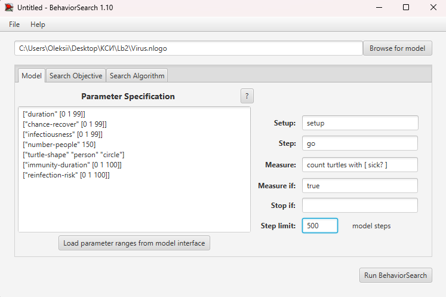
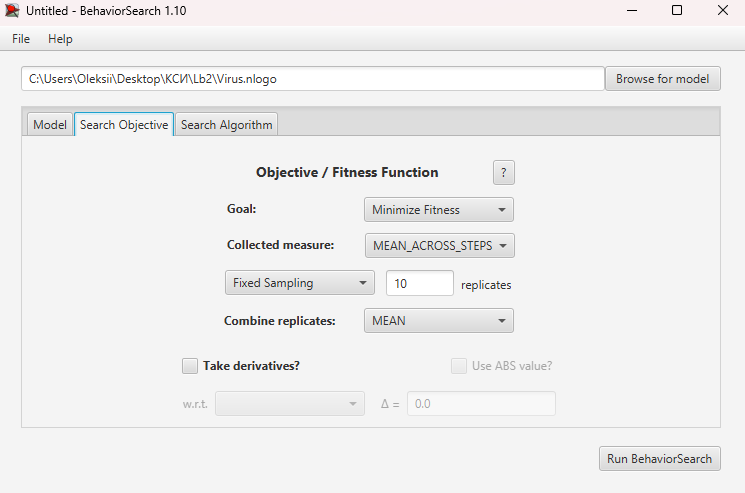
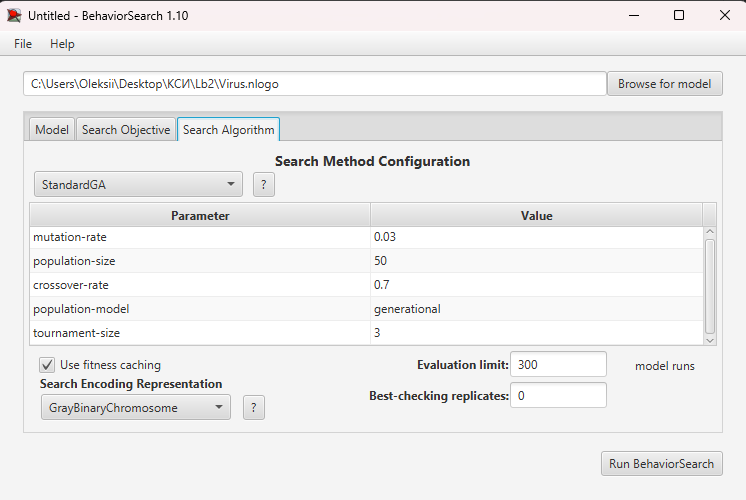
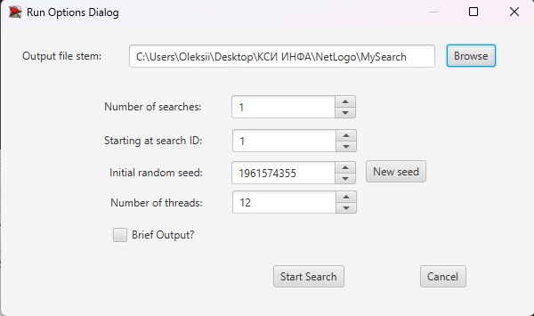
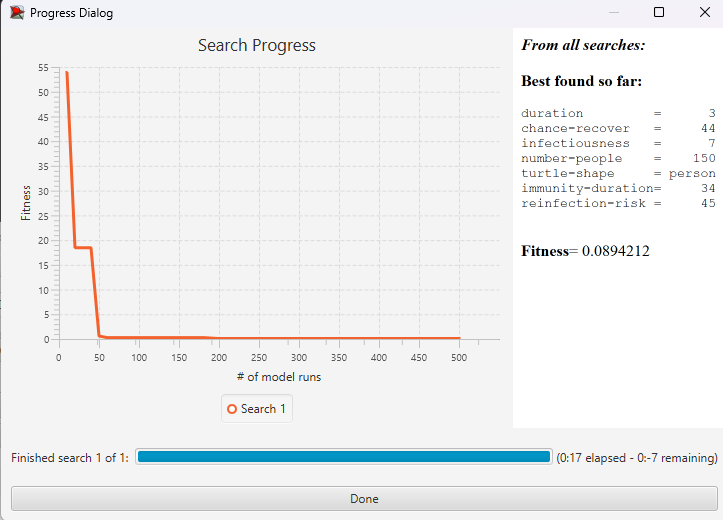
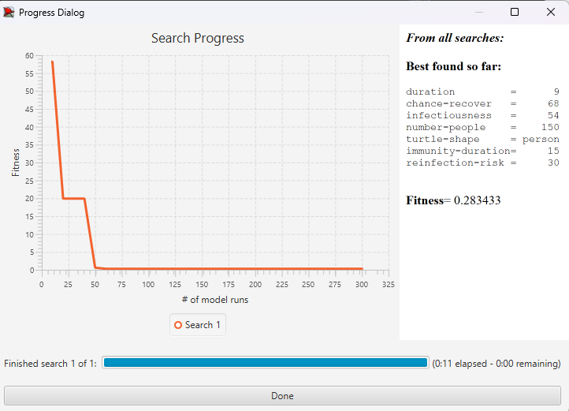

## Комп'ютерні системи імітаційного моделювання

## СПм-23-3, **Долгополов Олексій Максимовч**

### Лабораторна робота №**3**. Використання засобів обчислювального интелекту для оптимізації імітаційних моделей

 

### Варіант 3, модель у середовищі NetLogo:

[Virus](https://www.netlogoweb.org/launch#https://www.netlogoweb.org/assets/modelslib/Sample%20Models/Biology/Virus.nlogo)
 

### Вербальний опис моделі:

Модель поширення захворювання у людській популяції, де кожна людина представлена агентом (черепашкою). Кожен агент може бути в одному з трьох станів: здоровий, інфікований або імунний (після одужання). Інфіковані агенти можуть передавати захворювання іншим здоровим агентам, якщо ті знаходяться поруч. Через певний час хворі агенти можуть або одужати й отримати тимчасовий імунітет, або померти. Модель також враховує старіння та можливість народження нового потомства (агентів), що створює додаткову динаміку популяції.

### Керуючі параметри:

- **number-people** визначає кількість черепашок (агентів) у популяції..
- **infectiousness** визначає ймовірність зараження здорового агента під час контакту з інфікованим.
- **duration** визначає, як довго агент залишається інфікованим перед можливим одужанням або смертю.
- **chance-recover** визначає ймовірність того, що інфікований агент одужає після тривалого захворювання.
- **carrying-capacity** визначає максимальну кількість агентів у середовищі.
- **lifespan** визначає максимальну тривалість життя агента.
- **immunity-duration** визначає, скільки часу після одужання агент залишається імунним.
- **age-infection-factor** Вплив віку на інфекцію
- **adjusted-reproduction** Ймовірність розмноження залежно від % інфікованих
- **reinfection-risk** Керування імунітетом та ризиком повторного зараження

### Внутрішні параметри:

- **sick**. Стан агента: чи є він інфікованим.
- **remaining-immunity**. Кількість часу (в тижнях), протягом якого агент залишається імунним після одужання.
- **sick-time**. Час (в тижнях), який агент провів у стані інфекції.
- **age**. Вік агента (в тижнях).

### Показники роботи системи:

- відсоток інфікованих агентів на поточний момент часу.
- відсоток імунних агентів.
- кількість агентів, що одужали або померли.
- кількість нових заражень за кожен такт симуляції.
- визначає, скільки часу після одужання агент залишається імунним.
- керування імунітетом та ризиком повторного зараження

 

Налаштування середовища BehaviorSearch:
Обрана модель: <pre>C:\Program Files\NetLogo 6.3.0\models\Sample Models\Social Science\Traffic 2 Lanes.nlogo </pre>

Параметри моделі (вкладка Model):
Параметри та їх модливі діапазони були автоматично вилучені середовищем BehaviorSearch

<pre>
["duration" [0 1 99]]
["chance-recover" [0 1 99]]
["infectiousness" [0 1 99]]
["number-people" 150]
["turtle-shape" "person" "circle"]
["immunity-duration" [0 1 100]]
["reinfection-risk" [0 1 100]]
</pre>

Параметри для поля "Measure" були взяті з графіка "Populations"

**Налаштування цільової функції** (вкладка Search Objective):  
Метою підбору параметрів імітаційної моделі, що описує вірус, є **мінімізація** значення середньої кількості хворих у симуляції – це вказано через параметр "**Goal**" зі значенням **Minimaze Fitness**. Тобто необхідно визначити такі параметри налаштувань моделі, у яких кількість хворих е мінімальним. Для цього у параметрі "**Collected measure**", що визначає спосіб обліку значень обраного показника, вказано **MEAN_ACROSS_STEPS**.  
Щоб уникнути викривлення результатів через випадкові значення, що використовуються в логіці самої імітаційної моделі, **кожна симуляція повторюється по 10 разів**, результуюче значення розраховується як **середнє арифметичне**.

Загальний вигляд вкладки налаштувань цільової функції:

Налаштування алгоритму пошуку (вкладка Search Algorithm):

Загальний вид вкладки налаштувань алгоритму пошуку:

Результати використання BehaviorSearch:
Результат пошуку параметрів імітаційної моделі, використовуючи генетичний алгоритм:

Результат пошуку параметрів імітаційної моделі, використовуючи випадковий пошук:

